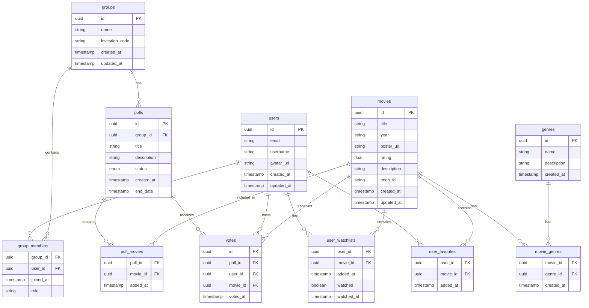

# Database Schema

## Overview
This document outlines the database schema for the Watch Together application. The schema is designed to support user authentication, movie management, group creation, and poll-based movie selection.

## Entity Relationship Diagram

## Table Descriptions

### Users
- Primary table for user information
- Stores basic user profile data
- Used for authentication and user identification

### Groups
- Stores group information
- Contains unique invitation codes
- Tracks creation and updates

### Group Members
- Junction table connecting users and groups
- Tracks when users joined groups
- Includes member roles (admin, member)

### Polls
- Stores poll information
- Links to specific groups
- Tracks status (active/completed)
- Includes creation and end dates

### Poll Movies
- Junction table connecting polls and movies
- Tracks which movies are included in each poll
- Records when movies were added to polls

### Votes
- Records user votes in polls
- Links users, polls, and selected movies
- Tracks when votes were cast

### Movies
- Central table for movie information
- Contains all movie metadata
- Includes TMDB ID for external API integration
- Stores basic movie information

### Genres
- Reference table for movie genres
- Used for categorization and filtering
- Contains genre names and descriptions

### Movie Genres
- Junction table connecting movies and genres
- Enables many-to-many relationship between movies and genres

### User Watchlists
- Junction table connecting users and their watchlist movies
- Tracks when movies were added to watchlist
- Includes watched status and timestamp

### User Favorites
- Junction table connecting users and their favorite movies
- Tracks when movies were added to favorites

## Relationships

1. **Users to Groups**: Many-to-many through group_members
   - Users can join multiple groups
   - Groups can have multiple members
   - Tracks member roles and join dates

2. **Groups to Polls**: One-to-many
   - Each group can have multiple polls
   - Each poll belongs to one group

3. **Polls to Movies**: Many-to-many through poll_movies
   - Each poll can have multiple movies
   - Movies can be in multiple polls
   - Tracks when movies were added to polls

4. **Votes**: Connects users, polls, and movies
   - One vote per user per poll
   - Links to specific movie selection

5. **Users to Watchlists/Favorites**: One-to-many
   - Users can have many movies in their lists
   - Each entry belongs to one user

6. **Movies to Genres**: Many-to-many through movie_genres
   - Movies can have multiple genres
   - Genres can be associated with multiple movies

## Indexes

The following indexes are recommended for optimal query performance:

1. `users(email)`: For user authentication
2. `groups(invitation_code)`: For group joining
3. `group_members(group_id, user_id)`: For member queries
4. `polls(group_id, status)`: For active polls in groups
5. `poll_movies(poll_id, movie_id)`: For poll movie queries
6. `votes(poll_id, user_id)`: For vote tracking
7. `movies(tmdb_id)`: For external API integration
8. `user_watchlists(user_id, movie_id)`: For watchlist queries
9. `user_favorites(user_id, movie_id)`: For favorites queries
10. `movie_genres(movie_id, genre_id)`: For genre-based queries

## Security Considerations

1. Row Level Security (RLS) policies should ensure:
   - Users can only access their own watchlist and favorites
   - Users can only access groups they're members of
   - Users can only vote once per poll
   - Only group admins can create polls
   - Movie data is readable by all authenticated users
   - Only administrators can modify movie and genre data

2. Data validation:
   - Email addresses should be unique and properly formatted
   - Movie ratings should be within valid range (0-10)
   - Invitation codes should be unique
   - Poll end dates should be after creation date
   - One vote per user per poll

## Future Considerations

1. Additional tables that might be needed:
   - `user_reviews`: For movie reviews and ratings
   - `user_comments`: For movie discussions
   - `movie_actors`: For cast information
   - `movie_directors`: For production information
   - `watch_events`: For scheduled watch sessions
   - `group_chat`: For group discussions

2. Potential features to consider:
   - Real-time poll updates
   - Movie recommendations based on watch history
   - Watch event scheduling
   - Social features (comments, reactions)
   - Cross-platform development
   - Integration with streaming services 